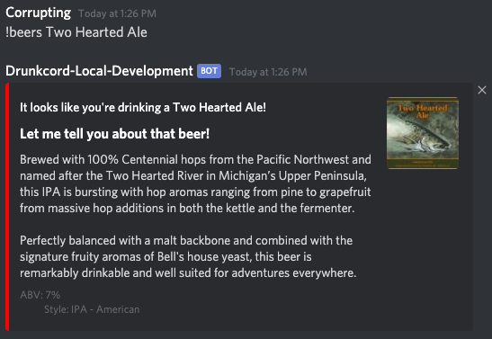
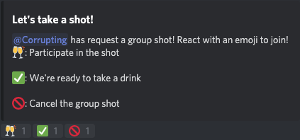

# Drunkcord

A Discord Bot to keep track of who is drinking in the Discord Server!

Use Drunkcord to orchestrate group shots, get useful information on the beer you're having, or just raise a glass and drink with a friendly drinking buddy!

## !cheers {drink name}

Adds the drink you are currently drinking

## !beers {beer name}

Outputs data from Untappd about the beer you're drinking!

## !shot

Do a group shot with your whole Discord server! React with emojis to join in on the fun!

## !drinks

How many total drinks have been had

## !drunk

Lists how many drinks each participant has had

## !closingtime

Clears the drink list

## !drunk-help

Lists all commands that Drunkcord knows
